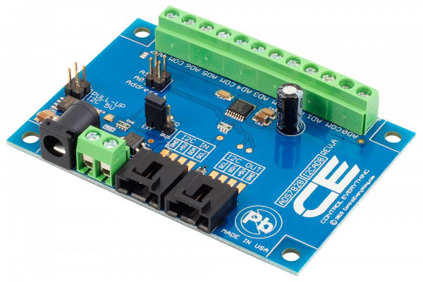

#ADS7828

The I2CADS7828 is a single-supply low-power 12-bit data acquisition device that features a serial I2C interface and an 8-channel multiplexer. The I2CAD8 is controller has an integrated I2C Input and Output port as well as screw terminal connectors for each analog input channel. 
This Device is available from www.ncd.io 

[SKU: ADS7828_I2CS]

(https://store.ncd.io/product/ads7828-analog-to-digital-converter-8-channel-12-bit-with-i2c-interface/)
This Sample code can be used with Arduino.

Hardware needed to interfacing ADS7828 ADC with Arduino

1. <a href="https://store.ncd.io/product/i2c-shield-for-arduino-nano/">Arduino Nano</a>

2. <a href="https://store.ncd.io/product/i2c-shield-for-arduino-micro-with-i2c-expansion-port/">Arduino Micro</a>

3. <a href="https://store.ncd.io/product/i2c-shield-for-arduino-uno/">Arduino uno</a>

4. <a href="https://store.ncd.io/product/dual-i2c-shield-for-arduino-due-with-modular-communications-interface/">Arduino Due</a>

5. <a href="https://store.ncd.io/product/ads7828-analog-to-digital-converter-8-channel-12-bit-with-i2c-interface/">ADS7828 8Channel 12Bit Analog To Digital Converter</a>

6. <a href="https://store.ncd.io/product/i%C2%B2c-cable/">I2C Cable</a>

ADS7828:

The I2CADS7828 is a single-supply low-power 12-bit data acquisition device that features a serial I2C interface and an 8-channel multiplexer. The I2CAD8 is controller has an integrated I2C Input and Output port as well as screw terminal connectors for each analog input channel.

Applications:

•Voltage supply Monitoring

•Isolated and remote data acquistion

•Battery operated systems

•Transducer interfaces

How to Use the ADS7828 Arduino Library
The ADS7828 has a number of settings, which can be configured based on user requirements.

1.Mode selection:The ADS7828 operating mode is determined by a command byte.

    1.Single ended/differential inputs selection:
  
        SD: Single-Ended/Differential Inputs
        0: Differential Inputs
        1: Single-Ended Inputs

        ads.setSDMode(SDMODE_SINGLE);       // Single-Ended Inputs
        
        ads.setSDMode(SDMODE_DIFF);       // Differential Inputs

     2.Power down selection mode:The following command selects the Internal reference "off" and ADC "on".
   
         ads.setPDMode(PDIROFF_ADON);        // Internal Reference OFF and A/D Converter ON
